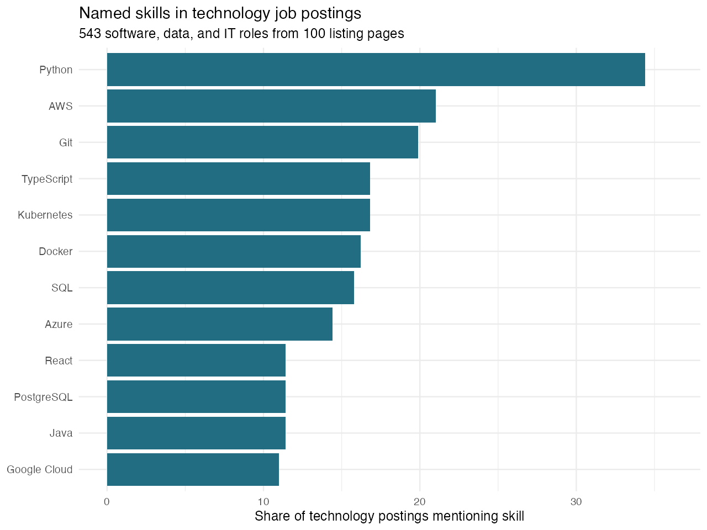
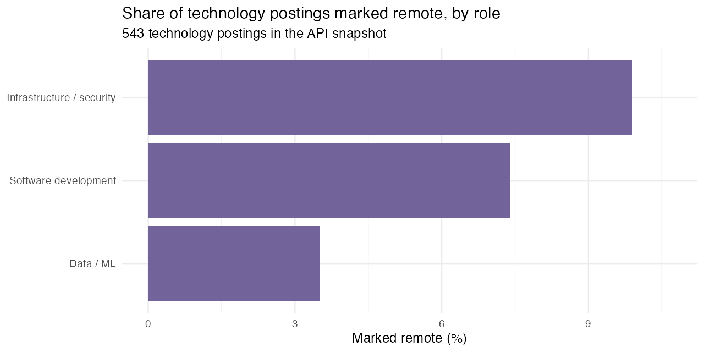

```{r}
#| include: false
library(readr)
library(dplyr)
library(knitr)
overview <- read_csv("results/summary.csv", show_col_types = FALSE)
skills <- read_csv("results/skill_counts.csv", show_col_types = FALSE)
role_skills <- read_csv("results/role_skill.csv", show_col_types = FALSE)
roles <- read_csv("results/role_counts.csv", show_col_types = FALSE)
seniority <- read_csv("results/seniority_counts.csv", show_col_types = FALSE)
remote_roles <- read_csv("results/remote_by_role.csv", show_col_types = FALSE)
pairs <- read_csv("results/skill_pairs.csv", show_col_types = FALSE)
```

## A career decision, not just a word count

Learning a new tool takes time. For someone interested in a software, data, or IT job, should the next project use Python, TypeScript, a cloud platform, or something else? Does the board offer remote or entry-level opportunities? Job advertisements offer practical clues. I used [Arbeitnow](https://www.arbeitnow.com/), a Germany-focused job board, to examine **skills, role types, work arrangement, and experience level**.

## From public pages to clean data

On September 21, 2026, my [R collection script](code/01_scrape_jobs.R) used `rvest` to read 100 public listing pages. It saved their HTML and extracted `r overview$all_html_listings` unique job titles and URLs. Of those titles, `r overview$tech_titles_in_100_pages` matched a documented software, data, or IT role pattern. Arbeitnow also offers a [public job-board API](https://www.arbeitnow.com/blog/job-board-api) with full descriptions; collecting its paginated feed avoided requesting thousands of individual job pages. The API ended after 29 pages of jobs and supplied `r overview$api_jobs_with_descriptions` unique descriptions, of which `r overview$tech_jobs_with_descriptions` matched the technology-role pattern. `r overview$html_api_overlap` API jobs also appeared in the 100-page HTML snapshot. The two sources are snapshots of the same changing board, so their page lists do not line up exactly.

```{r}
#| eval: false
#| echo: true
library(rvest)
page <- read_html("data/raw/html/page-001.html")
links <- html_elements(page, "a[data-job-item-link]")
job_urls <- html_attr(links, "href")
job_titles <- html_text2(links)
```

The [API pagination helper](code/extend_api_cache.R) manages the paced feed requests. The separate [analysis script](code/02_analyze_jobs.R) cleans description HTML, removes duplicate URLs, and searches for 20 named technologies. It counts a skill once per job even when the word appears repeatedly. **Every skill percentage below divides by the `r overview$tech_jobs_with_descriptions` technology jobs with descriptions**, not by all HTML listings. The scripts save the cleaned data, tables, and figures; the [README](README.md) gives replication commands. The complete project is in the [GitHub repository](https://github.com/liu118-oss/AEDS-6400-Blog). Collection used sequential requests with pauses, followed the site's [robots.txt](https://www.arbeitnow.com/robots.txt), and used no login or access workaround. Arbeitnow's [API terms](https://www.arbeitnow.com/terms) ask users to link back to the site.

## Which skills appear most often?

```{r}
#| label: tbl-top-skills
#| tbl-cap: "Most frequently mentioned technologies among 543 technology job descriptions. Postings can mention more than one skill."
skills |>
  slice_head(n = 7) |>
  transmute(Skill = skill, Postings = postings,
            `Share of technology postings` = paste0(share_pct, "%")) |>
  kable()
```



Python appears in `r skills$postings[skills$skill == "Python"]` postings (`r skills$share_pct[skills$skill == "Python"]`%), followed by AWS in `r skills$postings[skills$skill == "AWS"]` (`r skills$share_pct[skills$skill == "AWS"]`%) and Git in `r skills$postings[skills$skill == "Git"]` (`r skills$share_pct[skills$skill == "Git"]`%). Python and Git appear together in `r pairs$postings[pairs$skill_1 == "Git" & pairs$skill_2 == "Python"]` postings. These are **mentions**, not proof that every employer requires the skill. Percentages do not sum to 100 because one posting can name several technologies.

The overall ranking hides important differences. My title-based groups contain `r roles$postings[roles$role_group == "Software development"]` software development, `r roles$postings[roles$role_group == "Infrastructure / security"]` infrastructure or security, and `r roles$postings[roles$role_group == "Data / ML"]` data or machine-learning postings. The two most frequently named skills in each group are:

```{r}
#| label: tbl-role-skills
#| tbl-cap: "Top two skill mentions within each role group. Percentages use the number of jobs in that group."
role_skills |>
  group_by(role_group) |>
  slice_head(n = 2) |>
  ungroup() |>
  transmute(`Role group` = role_group, Skill = skill,
            Postings = postings, `Within-group share` = paste0(share_pct, "%")) |>
  kable()
```

## Work arrangement and experience level

Only `r overview$remote_tech_jobs` of the `r overview$tech_jobs_with_descriptions` technology jobs (`r overview$remote_share_pct`%) are **marked remote**. The other `r overview$tech_jobs_with_descriptions - overview$remote_tech_jobs` have `remote = FALSE` in the source. That means *not marked remote*; it does not prove they require full-time office attendance. Remote shares are `r remote_roles$remote_share_pct[remote_roles$role_group == "Infrastructure / security"]`% for infrastructure and security, `r remote_roles$remote_share_pct[remote_roles$role_group == "Software development"]`% for software development, and `r remote_roles$remote_share_pct[remote_roles$role_group == "Data / ML"]`% for data and machine learning. The last figure comes from just `r remote_roles$remote_jobs[remote_roles$role_group == "Data / ML"]` remote postings, so I would not infer a stable difference between fields.



Experience is another constraint: `r seniority$postings[seniority$seniority == "Senior / lead"]` postings (`r seniority$share_pct[seniority$seniority == "Senior / lead"]`%) include a senior or lead term in the title, while only `r seniority$postings[seniority$seniority == "Early career"]` (`r seniority$share_pct[seniority$seniority == "Early career"]`%) include an early-career term. The rest do not state a clear level in the title. An entry-level or remote job seeker should therefore filter listings by those needs **before** using the overall skill ranking to plan a project.

## What should a job seeker do?

If I were targeting **data or machine-learning roles**, I would build a Python project that queries and analyzes data with SQL: those two skills appear in `r role_skills$postings[role_skills$role_group == "Data / ML" & role_skills$skill == "Python"]` of `r roles$postings[roles$role_group == "Data / ML"]` data postings and `r role_skills$postings[role_skills$role_group == "Data / ML" & role_skills$skill == "SQL"]` of them, respectively. For **software development**, I would show Python or TypeScript in a working application. For **infrastructure**, I would demonstrate deploying and monitoring an application with Kubernetes or a cloud service. These projects provide evidence of ability rather than a list of keywords on a résumé.

The sample has limits. Arbeitnow is one board, many jobs are Germany-focused, and the title filter may miss relevant roles. A technology mentioned in company background or as a preference is still counted. Only `r overview$jobs_with_named_skill` of the `r overview$tech_jobs_with_descriptions` technology postings mention one of my 20 chosen terms, so the dictionary is incomplete. This analysis measures current advertised language, not hiring outcomes or the return to learning a skill.

## Takeaway

The useful lesson is to choose a **role and work arrangement first**, then use job descriptions to prioritize a small, demonstrable set of skills. Python is the broadest starting point here, but SQL, TypeScript, and Kubernetes matter differently across roles. Remote and early-career openings are a small, specifically labeled part of this sample. Check target postings before investing in a course, and repeat the analysis as listings change.
