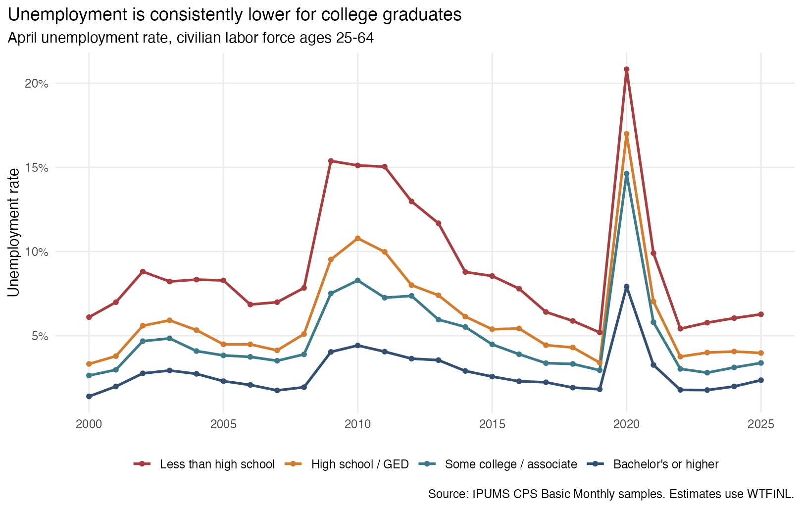
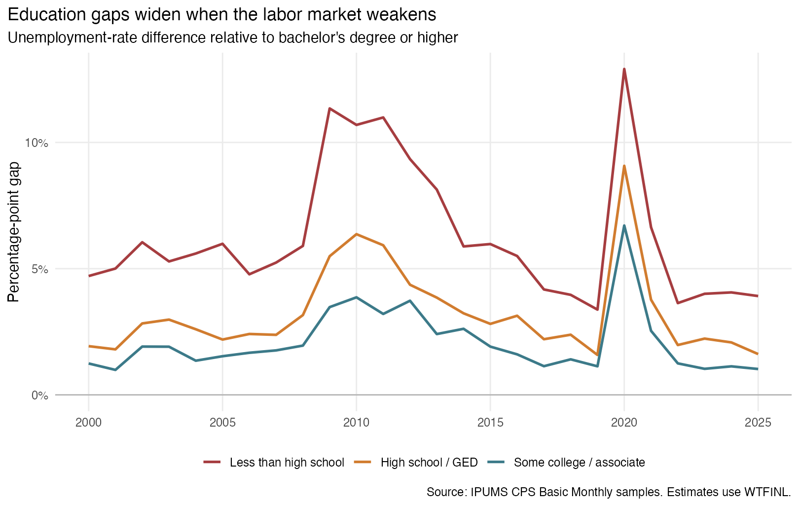
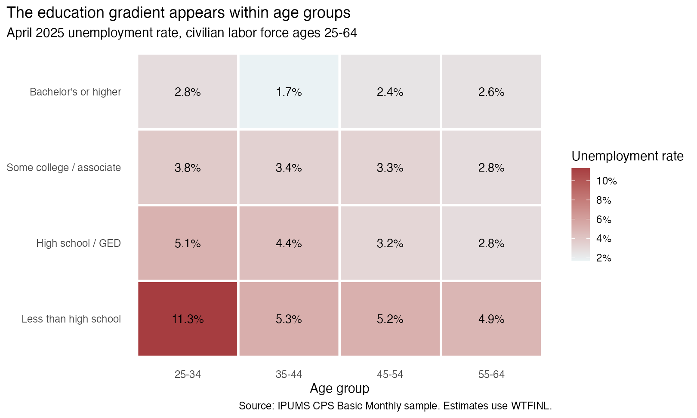

```{r}
#| include: false
library(readr)
library(dplyr)
library(knitr)
library(scales)

required_files <- c(
  "data/processed/annual_unemployment.csv",
  "data/processed/unemployment_by_age_2025.csv",
  "data/processed/education_gaps.csv",
  "results/headline_rates.csv",
  "results/01_unemployment_trends.png",
  "results/02_education_gaps.png",
  "results/03_age_education_heatmap.png"
)
results_ready <- all(file.exists(required_files))
if (results_ready) {
  annual <- read_csv(required_files[1], show_col_types = FALSE)
  age_2025 <- read_csv(required_files[2], show_col_types = FALSE)
  gaps <- read_csv(required_files[3], show_col_types = FALSE)
  headline <- read_csv(required_files[4], show_col_types = FALSE)
}
rate <- function(year, education) {
  annual |>
    filter(.data$year == .env$year, .data$education == .env$education) |>
    pull(unemployment_rate)
}
pp <- function(x) paste0(number(100 * x, accuracy = 0.1), " percentage points")
```

```{r}
#| results: asis
if (!results_ready) cat(
  "::: {.callout-warning collapse=\"false\"}\n",
  "## Data needed before publication\n\n",
  "This article is fully scripted but has not yet been populated because the required IPUMS CPS extract is not present. Follow the [README](README.md), run `code/01_analyze_cps.R`, and render again.\n",
  ":::\n",
  sep = ""
)
```

## Why unemployment by education matters

Unemployment is costly for workers and families, but its burden is not distributed evenly. Education may reduce unemployment risk by giving workers more specialized skills, access to a wider range of occupations, or stronger attachment to employers. It may also separate workers into industries that respond differently to recessions. I ask: **How does unemployment vary by education among U.S. adults ages 25-64, and does the gap change when the labor market weakens?**

## Data and method

I use [IPUMS CPS](https://cps.ipums.org/cps/), which harmonizes the monthly Current Population Survey across time. My extract contains April Basic Monthly samples from 2000 through 2025 and the variables `YEAR`, `MONTH`, `AGE`, `EDUC`, `LABFORCE`, `EMPSTAT`, and `WTFINL`. April gives one comparable cross-section per year and captures the abrupt pandemic disruption in April 2020.

The analysis includes civilians ages 25-64 who are in the labor force. I group education into four levels: less than high school, high school or GED, some college or an associate degree, and a bachelor's degree or higher. A person is unemployed when the detailed `EMPSTAT` code is 20-22. The unemployment rate is unemployed people divided by the civilian labor force.

Every estimate uses the final Basic Monthly CPS person weight, `WTFINL`:

$$
\text{Unemployment rate}_g=
\frac{\sum_{i\in g} WTFINL_i\times Unemployed_i}
{\sum_{i\in g} WTFINL_i}.
$$

This makes the results describe the U.S. population represented by the CPS rather than the raw observations in the extract. The complete [analysis script](code/01_analyze_cps.R) generates every table and figure.

## A persistent education gradient

```{r}
#| results: asis
if (results_ready) 
```

The first figure establishes whether unemployment rates differ consistently across education groups and shows how all four groups move with the national labor market. Comparing 2000, 2010, 2020, and 2025 also reveals which groups experienced the largest increases during weak labor markets.

```{r}
#| results: asis
if (results_ready) {
  low_2025 <- rate(2025, "Less than high school")
  ba_2025 <- rate(2025, "Bachelor's or higher")
  low_2020 <- rate(2020, "Less than high school")
  ba_2020 <- rate(2020, "Bachelor's or higher")
  cat(sprintf(
    "In April 2025, the weighted unemployment rate was **%s** for workers without a high-school diploma and **%s** for workers with a bachelor's degree or higher. The same ordering is visible across most years. During the April 2020 shock, the rates rose to **%s** and **%s**, respectively. Education therefore marks a persistent difference in unemployment risk, while all groups still move with the wider economy.",
    percent(low_2025, accuracy = 0.1), percent(ba_2025, accuracy = 0.1),
    percent(low_2020, accuracy = 0.1), percent(ba_2020, accuracy = 0.1)
  ))
}
```

## The gap changes over the business cycle

```{r}
#| results: asis
if (results_ready) 
```

The second figure subtracts the unemployment rate for bachelor's-degree holders from each other group's rate. This shifts attention from the overall cycle to inequality in unemployment risk. Higher lines during 2010 or 2020 indicate that downturns widened the education gap rather than raising unemployment equally for everyone.

```{r}
#| results: asis
if (results_ready) {
  gap_low_2020 <- low_2020 - ba_2020
  gap_low_2025 <- low_2025 - ba_2025
  direction <- if (gap_low_2020 > gap_low_2025) "larger" else "smaller"
  cat(sprintf(
    "The gap between the least-educated group and bachelor's-degree holders was **%s** in April 2020, compared with **%s** in April 2025. The recession-era gap was therefore %s. This comparison shows whether weaker labor markets merely raise unemployment or also concentrate more of the increase among workers with less education.",
    pp(gap_low_2020), pp(gap_low_2025), direction
  ))
}
```

## Education is not simply standing in for age

```{r}
#| results: asis
if (results_ready) 
```

Education and age are related: older adults have had more time to complete degrees, while younger workers have less labor-market experience. The final figure compares education groups within four age bands in 2025. A consistent education gradient within rows would show that the overall relationship is not solely the result of different age composition.

```{r}
#| results: asis
if (results_ready) {
  age_check <- age_2025 |>
    select(age_group, education, unemployment_rate) |>
    tidyr::pivot_wider(names_from = education, values_from = unemployment_rate) |>
    mutate(gradient = `Less than high school` > `Bachelor's or higher`)
  n_gradient <- sum(age_check$gradient, na.rm = TRUE)
  cat(sprintf(
    "In **%s of the four age groups**, unemployment was higher for adults without a high-school diploma than for adults with a bachelor's degree or higher. The comparison does not remove every possible difference between workers, but it shows how much of the aggregate education pattern remains after making a simple age adjustment.",
    n_gradient
  ))
}
```

## Interpretation and takeaway

These figures describe associations, not causal effects. Degree holders differ from other workers in occupation, industry, location, experience, and many other ways. The analysis also uses one month per year, so it describes April conditions rather than an annual average.

The practical lesson is that a single national unemployment rate can conceal large differences in economic security. Read together, the figures show whether more-educated workers experience lower unemployment in ordinary years, whether their advantage expands in downturns, and whether it remains visible within age groups. **The main takeaway is that education is related both to the level of unemployment risk and to how strongly workers are exposed when the labor market deteriorates.** For workforce agencies, the descriptive evidence can help target job-search assistance and retraining toward less-educated workers, especially during downturns.

## Data citation

Flood, Sarah, Miriam King, Renae Rodgers, Steven Ruggles, J. Robert Warren, Daniel Backman, Etienne Breton, Grace Cooper, Julia A. Rivera Drew, Stephanie Richards, David Van Riper, and Kari C. W. Williams. 2025. *IPUMS CPS: Version 13.0* [dataset]. Minneapolis, MN: IPUMS. [https://doi.org/10.18128/D030.V13.0](https://doi.org/10.18128/D030.V13.0).
