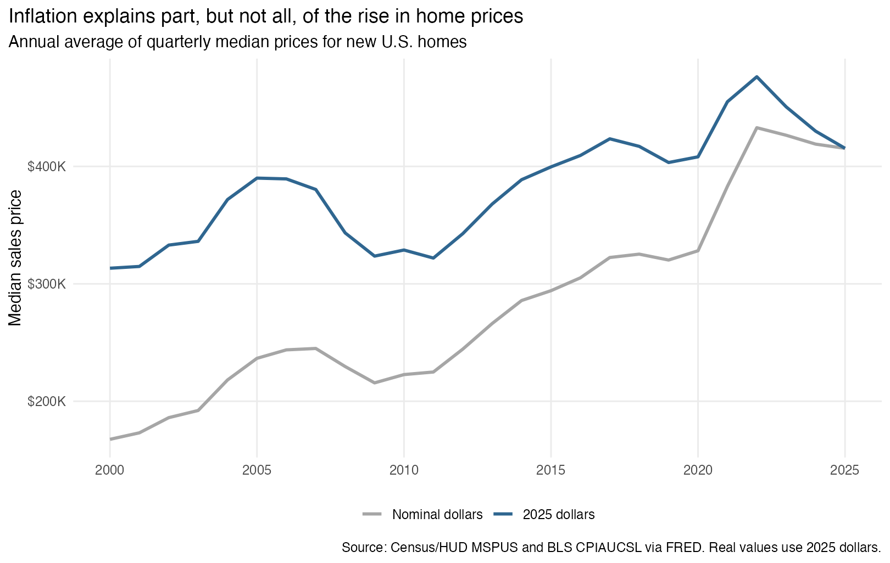
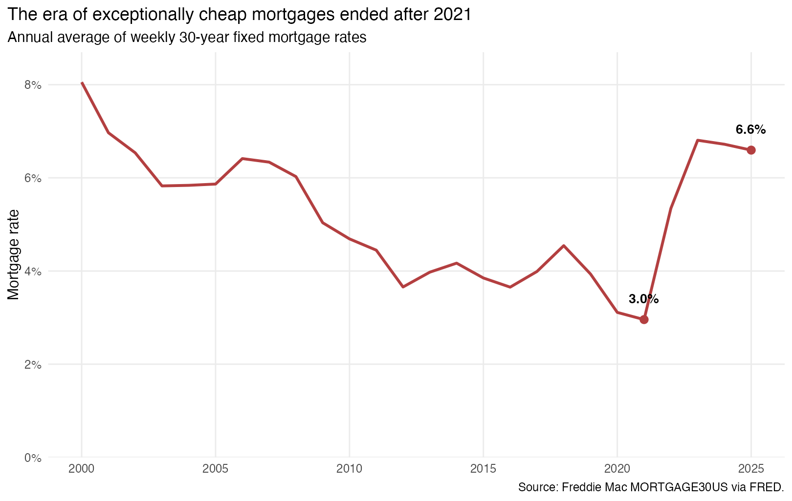
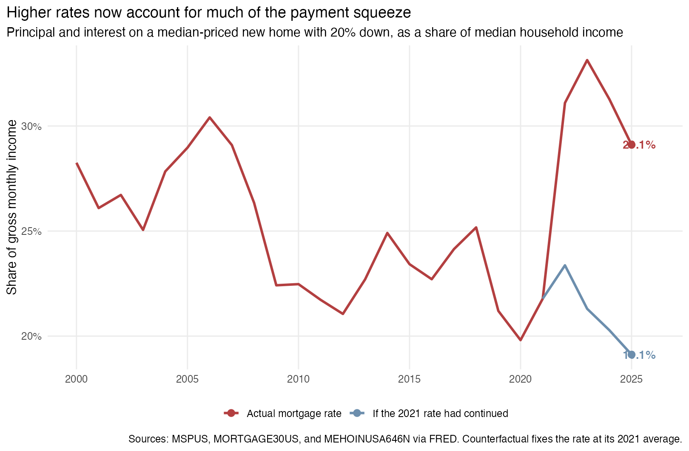

```{r}
#| include: false
library(readr)
library(dplyr)
library(scales)
library(knitr)

annual <- read_csv("data/processed/annual_housing_affordability.csv", show_col_types = FALSE)
row <- function(selected_year) annual |> filter(year == selected_year)
r2021 <- row(2021)
r2025 <- row(2025)
r2023 <- row(2023)
```

## The question

Buying a home depends on more than its advertised price. Most households borrow, so mortgage rates determine how much of the price becomes a monthly payment. Income growth and inflation also affect whether comparisons across years are meaningful. I ask: **How have home prices and mortgage rates jointly changed the affordability of buying a typical new U.S. home since 2000?**

This question matters to households deciding whether a home fits their budget and to policymakers trying to understand why affordability can remain weak even when prices stop rising.

## Data and method

I download four public series programmatically from the Federal Reserve Bank of St. Louis's [FRED](https://fred.stlouisfed.org/) CSV endpoint: the median sales price of new houses (`MSPUS`), the 30-year fixed mortgage rate (`MORTGAGE30US`), the Consumer Price Index (`CPIAUCSL`), and median household income (`MEHOINUSA646N`). The underlying sources are the Census Bureau and HUD, Freddie Mac, the Bureau of Labor Statistics, and the Census Bureau.

The series have different frequencies, so I calculate annual averages of quarterly home prices, weekly mortgage rates, and monthly CPI. Household income is already annual. I limit the analysis to 2000–2025, the latest complete year shared by all four series.

Two transformations make the comparison economically meaningful. First, I use CPI to express home prices in 2025 dollars. Second, I estimate the monthly principal-and-interest payment on the median-priced home, assuming a 20% down payment and a 30-year fixed mortgage. I divide that payment by median monthly household income. This payment burden is an illustration, not a lending standard, and excludes property taxes, insurance, maintenance, and transaction costs. The complete [R analysis](code/01_analyze_housing.R) downloads the data and generates every result.

## Sticker prices overstate part of the long-run increase

```{r}

```

The nominal median new-home price increased from `r dollar(row(2000)$home_price, accuracy = 1)` in 2000 to `r dollar(r2025$home_price, accuracy = 1)` in 2025. After accounting for inflation, the increase is smaller: the 2000 price equals about `r dollar(row(2000)$real_home_price_2025, accuracy = 1)` in 2025 dollars. Inflation therefore explains an important part of the apparent increase, although real home prices still rose by `r percent(r2025$real_home_price_2025 / row(2000)$real_home_price_2025 - 1, accuracy = 1)`.

The real-price series also changes the interpretation of the recent decline. In 2025 dollars, the annual average fell from approximately `r dollar(row(2022)$real_home_price_2025, accuracy = 1)` in 2022 to `r dollar(r2025$real_home_price_2025, accuracy = 1)` in 2025, a decline of `r percent(1 - r2025$real_home_price_2025 / row(2022)$real_home_price_2025, accuracy = 1)`. Even after that correction, the 2025 level remained `r percent(r2025$real_home_price_2025 / row(2019)$real_home_price_2025 - 1, accuracy = 1)` above 2019. Buyers therefore received some price relief after 2022, but did not return to the pre-pandemic market.

## Mortgage rates reversed direction after 2021

```{r}

```

The average 30-year mortgage rate fell to `r percent(r2021$mortgage_rate / 100, accuracy = 0.1)` in 2021, allowing buyers to finance expensive homes relatively cheaply. By 2025, the average was `r percent(r2025$mortgage_rate / 100, accuracy = 0.1)`. The higher rate matters because it raises every monthly payment without changing the home's purchase price or providing the buyer with more housing.

High mortgage rates are not historically unique: the 2000 average was `r percent(row(2000)$mortgage_rate / 100, accuracy = 0.1)`. What changed is the amount being financed relative to income. The median new-home price equaled about `r number(row(2000)$price_to_income, accuracy = 0.1)` years of median household income in 2000 and `r number(r2025$price_to_income, accuracy = 0.1)` years in 2025. The same interest rate can therefore create a different burden when the loan principal and household income have changed.

## The combined payment burden tells the clearest story

```{r}

```

For the assumptions used here, the estimated payment rose from `r dollar(r2021$monthly_payment, accuracy = 1)` per month in 2021 to `r dollar(r2025$monthly_payment, accuracy = 1)` in 2025. It increased from `r percent(r2021$payment_burden, accuracy = 0.1)` to `r percent(r2025$payment_burden, accuracy = 0.1)` of median gross household income. The burden peaked at `r percent(r2023$payment_burden, accuracy = 0.1)` in 2023.

The counterfactual line holds the mortgage rate at its 2021 average while allowing home prices and income to change. At that low rate, the 2025 payment would have been approximately `r dollar(r2025$payment_at_2021_rate, accuracy = 1)`, or `r percent(r2025$burden_at_2021_rate, accuracy = 0.1)` of income. The difference—about **`r dollar(r2025$monthly_payment - r2025$payment_at_2021_rate, accuracy = 1)` per month**—shows why modest price declines have not fully restored affordability.

## What this benchmark leaves out

This national comparison does not represent every buyer. `MSPUS` covers newly built homes, which can differ from existing homes in size, location, and quality. The median home and median household also come from separate datasets, so this is not the payment made by one observed household. Annual averages conceal changes within a year and large differences across local markets. Finally, many buyers put down less than 20%, and the calculation excludes mortgage insurance, property taxes, homeowners insurance, maintenance, fees, and closing costs. These omissions generally make the displayed payment smaller than the full monthly cost of ownership.

::: {.callout-important}
## What this means for households and policymakers

For a prospective buyer, the useful comparison is the complete monthly cost relative to income, rather than the listing price alone. In 2025, principal and interest on the typical new home consumed about `r percent(r2025$payment_burden, accuracy = 0.1)` of median gross household income before taxes, insurance, or maintenance. Buyers should calculate the payment at the rate they can actually obtain and leave room for those additional costs.

For policymakers, the results separate two problems. Lower rates would reduce payments quickly, but rates move with broader financial conditions. Expanding housing supply addresses the price side more directly and can improve affordability without depending on a return to unusually low mortgage rates.
:::

## Takeaway

New-home prices remain high, but the recent affordability squeeze cannot be understood from prices alone. **The transition from a `r percent(r2021$mortgage_rate / 100, accuracy = 0.1)` mortgage rate in 2021 to `r percent(r2025$mortgage_rate / 100, accuracy = 0.1)` in 2025 added roughly `r dollar(r2025$monthly_payment - r2025$payment_at_2021_rate, accuracy = 1)` to the illustrative monthly payment on a 2025 median-priced new home.** Households should evaluate homes using payment-to-income calculations, while durable policy improvements require attention to both financing conditions and the supply of homes.

## Sources

- [Median Sales Price of New Houses Sold, MSPUS](https://fred.stlouisfed.org/series/MSPUS), U.S. Census Bureau and U.S. Department of Housing and Urban Development.
- [30-Year Fixed Rate Mortgage Average, MORTGAGE30US](https://fred.stlouisfed.org/series/MORTGAGE30US), Freddie Mac.
- [Consumer Price Index, CPIAUCSL](https://fred.stlouisfed.org/series/CPIAUCSL), U.S. Bureau of Labor Statistics.
- [Median Household Income, MEHOINUSA646N](https://fred.stlouisfed.org/series/MEHOINUSA646N), U.S. Census Bureau.
